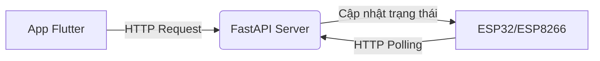

# ⚡ Hệ Thống Nhà Thông Minh IoT ⚡

Dự án IoT điều khiển đèn LED thông qua WiFi, sử dụng Flutter, FastAPI và ESP32/ESP8266.

---

### Ý Tưởng Chính

Mục tiêu của dự án là xây dựng một hệ thống IoT hoàn chỉnh, cho phép người dùng điều khiển các thiết bị điện trong nhà từ xa thông qua một ứng dụng di động. Hệ thống được thiết kế để có tốc độ phản hồi nhanh, dễ dàng cài đặt và mở rộng.

### Kiến Trúc Hệ Thống

Luồng dữ liệu của hệ thống được thiết kế theo mô hình Client-Server-Device đơn giản và hiệu quả.



1.  **App (Client):** Gửi lệnh điều khiển.
2.  **Server (Backend):** Nhận lệnh, lưu trạng thái và làm trung gian giao tiếp.
3.  **ESP (Device):** Liên tục hỏi trạng thái mới từ server và thực thi lệnh (bật/tắt đèn).

### Công Nghệ Sử Dụng

*   **Backend:** Python & FastAPI
*   **Frontend:** Flutter & Dart
*   **Firmware:** C++ (Với PlatformIO hoặc Arduino)
*   **Vi điều khiển:** ESP8266 hoặc ESP32

### Cấu Trúc Dự Án
```
IoT_SmartHome_Project/
│
├── 📂 client_app/              # Ứng dụng di động Flutter
│   ├── 📂 lib/
│   │   ├── 📂 models/          # Định nghĩa object (VD: Device)
│   │   ├── 📂 screens/         # Màn hình UI (Home, Settings)
│   │   ├── 📂 services/        # Logic nghiệp vụ (Gọi API)
│   │   ├── 📂 utils/           # Tiện ích và hằng số
│   │   ├── 📂 widgets/         # UI Components tái sử dụng
│   │   └── 📄 main.dart        # Điểm khởi đầu của ứng dụng
│   └── 📄 pubspec.yaml         # Quản lý thư viện Flutter
│
├── 📂 firmware_esp32/          # Firmware cho thiết bị (ESP32/ESP8266)
│   ├── 📂 src/
│   │   └── 📄 main.cpp         # Mã nguồn chính (C++)
│   └── 📄 platformio.ini       # Cấu hình PlatformIO
│
└── 📂 server_backend/          # Hệ thống backend Python
    ├── 📂 app/
    │   ├── 📂 api/             # Định nghĩa các API endpoints
    │   ├── 📂 core/            # Cấu hình lõi
    │   ├── 📂 models/          # Pydantic models
    │   ├── 📂 services/        # Các dịch vụ logic
    │   └── 📄 main.py          # Entry point (FastAPI)
    ├── 📄 requirements.txt     # Danh sách thư viện Python
    └── 📄 .env                 # Biến môi trường
```

---

##  Cài Đặt & Vận Hành

Thực hiện theo 3 bước dưới đây để khởi chạy toàn bộ hệ thống.

### 1. Backend (Server)

Phần bộ não của hệ thống, xử lý các yêu cầu từ ứng dụng.

```bash
# 1. Đi tới thư mục backend
cd server_backend

# 2. Tạo và kích hoạt môi trường ảo
python -m venv venv
.\venv\Scripts\activate

# 3. Cài đặt các gói cần thiết
pip install -r requirements.txt

# 4. Khởi chạy server
uvicorn app.main:app --host 0.0.0.0 --port 8000
```
> 💡 Server sẽ chạy tại `http://<IP_CỦA_BẠN>:8000`. Hãy ghi nhớ địa chỉ IP này.

### 2. Firmware (Thiết bị ESP)

Phần cứng để thực thi lệnh bật/tắt đèn.

1.  **Mở thư mục `firmware_esp32`** bằng Visual Studio Code đã cài đặt PlatformIO.
2.  **Mở file `src/main.cpp`** và chỉnh sửa các thông tin sau:
    ```cpp
    // Thay bằng thông tin mạng WiFi của bạn
    const char* ssid = "TEN_WIFI";
    const char* password = "MAT_KHAU_WIFI";

    // Thay bằng IP của máy tính đang chạy server ở Bước 1
    String serverUrl = "http://192.168.1.X:8000/device/status/led_1"; 
    ```
3.  **Kết nối bo mạch ESP** vào máy tính.
4.  Sử dụng PlatformIO để **Build** và **Upload** code vào bo mạch.

### 3. Frontend (Ứng dụng di động)

Giao diện để người dùng tương tác và điều khiển.

1.  **Mở một cửa sổ dòng lệnh mới** và đi tới thư mục ứng dụng:
    ```bash
    cd client_app
    ```
2.  **Cập nhật địa chỉ IP** của server trong code (thường nằm ở các file trong thư mục `lib/services/` hoặc `lib/utils/`).
3.  **Tải các gói phụ thuộc:**
    ```bash
    flutter pub get
    ```
4.  **Chạy ứng dụng** trên máy ảo hoặc thiết bị thật:
    ```bash
    flutter run
    ```

---

### Giao Tiếp API

Hệ thống sử dụng REST API đơn giản để giao tiếp.

*   **Lấy trạng thái thiết bị:**
    *   **Method:** `GET`
    *   **URL:** `/device/status/{device_id}`
    *   **Phản hồi:** `{"device_id": "led_1", "status": true}`

*   **Cập nhật trạng thái thiết bị:**
    *   **Method:** `POST`
    *   **URL:** `/device/update`
    *   **Body:** `{"device_id": "led_1", "status": false}`
    *   **Phản hồi:** `{"message": "Update successful"}`

### 🗺️ Roadmap

- [ ] Build file APK cho Android
- [ ] Cấu hình IP tĩnh cho Server
- [ ] Hỗ trợ điều khiển qua Internet (sử dụng DDNS hoặc VPS)
- [ ] Cấu hình WiFi cho thiết bị ESP từ ứng dụng (WiFi Provisioning)
- [ ] Tích hợp điều khiển bằng giọng nói (Google Assistant, Alexa)

### Tác Giả

*   **Hà Quang Chương** (chuongdev)
*   *Sinh viên Khoa Điện tử Viễn thông - Đại học Điện Lực (EPU).*
