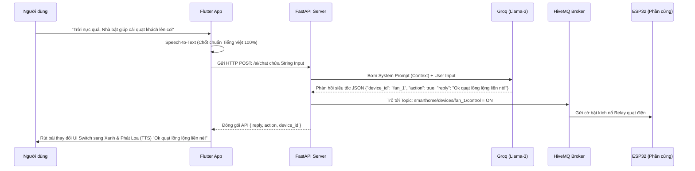

# Báo Cáo Tích Hợp AI Mới (Groq + Llama-3.3-70B)

Báo cáo chi tiết về quá trình tối ưu hóa và nâng cấp hệ thống AI nhận diện ý định lệnh giọng nói (Intent Recognition) cho dự án AIoT SmartHome, chuyển đổi thành công từ Google Gemini sang nền tảng LPU siêu tốc của Groq.

## 1. Vấn Đề Tồn Đọng (Pain Points) Trước Khắc Phục
- **Google Gemini (2.5-flash):** Phân hạng Free Tier hiện tại bị Google siết cực kì gắt (Giới hạn khoảng 15 Request/Phút). Dẫn đến tình trạng "Lỗi Không Kết Nối Não Bộ" (HTTP 429) liên tục khi test đấm nút thu âm dồn dập.
- **Thư Viện G4F (Chơi đồ lậu):** Hoàn toàn thất bại do tính không ổn định của việc Scrape server bên thứ 3. Mô hình tự động block và liên tục văng Message Catch Error bắt điền API Key.
- **Lỗ tai của Máy Ảo (Emulator Android):** Mặc định Android AVD không cài gói Nhận diện giọng nói gốc Tiếng Việt Offline. Khi thu nhận sóng âm, Cỗ máy tự rặn thành từ Tiếng Anh na ná (ví dụ _"Quạt phòng khách"_ => _"what you talking"_), làm sai lệch hoàn toàn đầu vào (Input text) của con AI.

## 2. Giải Pháp Vừa Triển Khai Thực Tế

> Đập bỏ toàn bộ tích hợp Gemini cũ - Đưa con quái vật Groq Cloud (Tích hợp core LLM Mở đỉnh nhất nhì thế giới **Llama-3.3-70B-Versatile**) vào thay thế. Tốc độ xuất JSON của con chip LPU nhà Groq gánh toàn bộ độ trễ của hệ thống xuống sát tiệm cận 0!

### Xây Lại "Bộ Não" Ở Backend (`main.py` & `config.py`)
- **Khởi tạo Async Client:** Sử dụng Module `groq.AsyncGroq` đồng bộ luồng xử lý bất đồng bộ (Async/Await) của FastAPI. Backend hoàn toàn nhẹ gánh, không bị chặn đứng vòng lặp khi ném lệnh đi chờ tin báo về từ AI.
- **Quota Thần Thánh Xài Thả Ga:** Groq mở cửa xả láng với Quota Rate Limit khổng lồ. Tạm biệt lỗi 429 phiền toái trên Smart Home!
- **Prompt Engineering Khắt Khe Khóa Chặt JSON:** Ấn định tham số suy luận `temperature=0.3` để model có tính nhất quán 100%, không bị "ảo giác" tán dóc đi xa. Vặn chặt yêu cầu **chỉ trả về Format JSON tĩnh**: `{"device_id", "action", "reply"}`. Ngôn ngữ giao tiếp AI xéo sắc kiểu bạn thân, gen Z được rèn luyện vào system prompt.

### Gỡ Điếc Trên Frontend (`dashboard_screen.dart`)
- Lập tức dỡ bỏ khai báo cứng định dạng `vi_VN` (tiềm ẩn cực kỳ nhiều rủi ro Tùy biến Region trên dòng `localeId`).
- Thay thế hoàn toàn bằng thuật toán hàm `_speech.locales()`: Quét tung danh sách ngôn ngữ Audio Core Dictionary của bản thân thiết bị Đang Chạy (kể cả Simulator hay iPhone/Xiaomi máy thật). 
- Dùng logic lặp tìm và bám chặt điểm khớp chuỗi `.startsWith("vi")` để gắp đúng cú pháp Key tiếng Việt mà hệ thống đó chứa. Cắt đứt tỷ lệ phần trăm dội ngược về ngôn ngữ tiếng Anh mặc định.

## 3. Bản Đồ Sự Kiện Theo Thời Gian Thực (Real-time Event Flow Diagram)

## 4. Nhật Ký Kết Quả Khắt Khe Dọn Rác Code Toàn Bộ Thư Mục
Toàn bộ các File Scripts rác nằm vương vãi trong lúc Test và Debug cực khổ như chó  (`test_all.py`, `test_all2.py`, `test_g4f.py`, `output.txt`, các file Model Logs v.v.) 