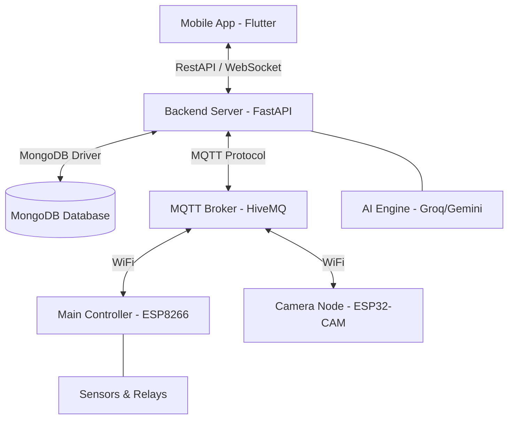

# 🏠 HƯỚNG DẪN CÀI ĐẶT & VẬN HÀNH HỆ THỐNG — NexHome AIoT SmartHome

> **Dự án:** Hệ thống Nhà Thông Minh tích hợp AI và Camera Giám sát  
> **Sinh viên thực hiện:** Hà Quang Chương — Lớp D17DT&KTMT1, Đại học Điện lực (EPU)  
> **Công nghệ lõi:** Flutter · FastAPI · MQTT · MongoDB · ESP8266 · ESP32-CAM

---

## 📖 MỤC LỤC

1. [Tổng quan hệ thống](#1-tổng-quan-hệ-thống)
2. [Chuẩn bị phần mềm & Phần cứng](#2-chuẩn-bị-phần-mềm--phần-cứng)
3. [Cấu trúc thư mục dự án](#3-cấu-trúc-thư-mục-dự-án)
4. [Cài đặt MongoDB](#4-cài-đặt-mongodb)
5. [Cài đặt Backend (FastAPI)](#5-cài-đặt-backend-fastapi)
6. [Cài đặt Mobile App (Flutter)](#6-cài-đặt-mobile-app-flutter)
7. [Nạp Firmware & Cấu hình Phần cứng](#7-nạp-firmware--cấu-hình-phần-cứng)
8. [Cấu hình Biến môi trường (.env)](#8-cấu-hình-biến-môi-trường-env)
9. [Kết nối App với Server từ xa (Ngrok)](#9-kết-nối-app-với-server-từ-xa-ngrok)
10. [Hướng dẫn Vận hành toàn hệ thống](#10-hướng dẫn-vận-hành-toàn-hệ-thống)
11. [Xử lý sự cố thường gặp (Troubleshooting)](#11-xử-lý-sự-cố-thường-gặp-troubleshooting)

---

## 1. Tổng quan hệ thống

Hệ thống NexHome được xây dựng dựa trên mô hình **Hybrid-Cloud**, kết hợp giữa điều khiển tại chỗ (Real-time qua WebSocket/MQTT) và tính năng thông minh AI (Gemini/Groq).

### 📐 Sơ đồ kiến trúc



### 🌟 Tính năng nổi bật
- **AI Voice Assistant**: Điều khiển nhà bằng giọng nói tự nhiên thông qua AI.
- **Dynamic GPIO Mapping**: Thay đổi chân Pin điều khiển ngay trên App mà không cần nạp lại code cho ESP.
- **Smart Scheduling**: Hẹn giờ bật/tắt thiết bị linh hoạt (Lưu trữ và thực thi tại Server).
- **Security Camera**: Livestream và điều khiển đèn Flash từ xa.

---

## 2. Chuẩn bị phần mềm & Phần cứng

### 💻 Phần mềm (Môi trường phát triển)

| Công cụ | Phiên bản | Ghi chú |
|:---:|:---:|:--- |
| **Python** | 3.10+ | Chạy Backend và các tập lệnh hỗ trợ |
| **Flutter SDK** | 3.24+ | Xây dựng ứng dụng di động |
| **MongoDB** | 7.0+ | Cơ sở dữ liệu NoSQL |
| **VS Code** | Latest | Trình soạn thảo mã nguồn chính |
| **PlatformIO** | Latest | Extension của VS Code để nạp code cho ESP |
| **Ngrok** | Latest | Tạo tunnel kết nối từ App tới localhost |

### 🔌 Phần cứng (IoT Devices)

1.  **ESP8266 NodeMCU v2**: Node điều khiển chính.
2.  **ESP32-CAM**: Node xử lý hình ảnh và stream camera.
3.  **Cảm biến**: DHT11 (Nhiệt độ/Độ ẩm), PIR HC-SR501 (Chuyển động).
4.  **Chấp hành**: Module Relay 5V (2 kênh), LED, Còi báo.

---

## 3. Cấu trúc thư mục dự án

```text
IoT_SmartHome_Project/
├── client_app/          # Mã nguồn ứng dụng Flutter
├── server_backend/      # Mã nguồn Backend FastAPI (Python)
├── firmware_esp32/      # Code cho Node chính (Sử dụng ESP8266)
├── firmware_esp32_cam/  # Code cho Node Camera (Sử dụng ESP32-CAM)
└── doc/                 # Tài liệu hướng dẫn và báo cáo
```

---

## 4. Cài đặt MongoDB

> [!NOTE]
> MongoDB là nơi lưu trữ trạng thái thiết bị, lịch sử hoạt động và thông tin người dùng.

1.  Truy cập [MongoDB Download](https://www.mongodb.com/try/download/community) và tải bản **7.0 (MSI)**.
2.  Cài đặt theo chế độ **"Complete"**.
3.  Đảm bảo tích chọn **"Install MongoDB as a Service"**.
4.  Hệ thống sẽ chạy ngầm tại `localhost:27017`.
5.  (Khuyên dùng) Cài đặt **MongoDB Compass** để trực quan hóa dữ liệu.

---

## 5. Cài đặt Backend (FastAPI)

1.  Mở terminal tại thư mục `server_backend/`.
2.  Tạo và kích hoạt môi trường ảo:
    ```bash
    python -m venv venv
    venv\Scripts\activate
    ```
3.  Cài đặt các thư viện cần thiết:
    ```bash
    pip install -r requirements.txt
    ```
4.  Khởi tạo Database ban đầu (Chỉ chạy 1 lần):
    ```bash
    python init_db.py
    ```

---

## 6. Cài đặt Mobile App (Flutter)

1.  Mở terminal tại thư mục `client_app/`.
2.  Cài đặt dependencies:
    ```bash
    flutter pub get
    ```
3.  Kết nối điện thoại Android hoặc mở máy ảo (Android Studio).
4.  Chạy ứng dụng:
    ```bash
    flutter run
    ```
    *(Lưu ý: Mặc định App sẽ trỏ tới URL trong file cấu hình, xem bước Ngrok để kết nối thực tế)*.

---

## 7. Nạp Firmware & Cấu hình Phần cứng

### 7.1. Cấu hình PlatformIO
1.  Mở VS Code, truy cập phần **Extensions** và cài đặt **PlatformIO IDE**.
2.  Mở thư mục `firmware_esp32/` (hoặc `firmware_esp32_cam/`).

### 7.2. Nạp code cho ESP8266 (Node chính)
- Kết nối ESP8266 vào máy tính.
- Nhấn biểu tượng mũi tên (**→ Upload**) ở thanh công cụ dưới cùng của VS Code.
- Sau khi nạp xong, ESP sẽ phát WiFi tên **"SmartHome-Config"**. Kết nối điện thoại vào WiFi này để cấu hình WiFi nhà bạn.

### 7.3. Nạp code cho ESP32-CAM
- Sử dụng đế nạp chuyên dụng hoặc mạch UART (nối chân GPIO 0 xuống GND khi nạp).
- Nhấn **Upload** tương tự như ESP8266.

---

## 8. Cấu hình Biến môi trường (.env)

Tạo file `.env` bên trong thư mục `server_backend/` với nội dung mẫu sau:

```env
# Database
MONGODB_URL=mongodb://localhost:27017
MONGODB_DB_NAME=smarthome_db

# MQTT (Khuyên dùng HiveMQ Public)
MQTT_BROKER_URL=broker.hivemq.com
MQTT_BROKER_PORT=1883

# AI Engine
GROQ_API_KEY=gsk_your_key_here

# Security
JWT_SECRET_KEY=nexhome_secret_key_2026

# Email OTP
SMTP_USER=your_email@gmail.com
SMTP_PASS=app_password_here
```

---

## 9. Kết nối App với Server từ xa (Ngrok)

Để App trên điện thoại điều khiển được Server chạy trên máy tính của bạn:

1.  Mở phần mềm Ngrok và chạy lệnh:
    ```bash
    ngrok http 8000
    ```
2.  Copy đường dẫn dạng `https://xxxx.ngrok-free.app`.
3.  **Trong ứng dụng Mobile:** Tại màn hình Đăng nhập, **nhấn giữ Logo** khoảng 3 giây → Một bảng cài đặt sẽ hiện ra → Dán link Ngrok vào và nhấn Lưu.

---

## 10. Hướng dẫn Vận hành toàn hệ thống

### Thứ tự khởi động khuyến nghị:
1.  **Bật Database**: Đảm bảo Service MongoDB đang chạy.
2.  **Khởi động Backend**: Chạy lệnh `python -m uvicorn app.main:app --host 0.0.0.0 --port 8000 --reload`.
3.  **Khởi động Ngrok**: Lấy link tunnel.
4.  **Bật Thiết bị IoT**: Cắm nguồn cho ESP8266 và Camera.
5.  **Mở App**: Đăng nhập và trải nghiệm.

### Sử dụng AI Voice Assistant:
- Nhấn vào biểu tượng **Micro** trên Dashboard.
- Nói các câu lệnh tự nhiên: *"Bật đèn phòng khách giúp mình"*, *"Mình cảm thấy hơi nóng"*, hoặc *"Tắt hết thiết bị khi mình đi vắng"*.
- AI sẽ tự động phân tích ngữ nghĩa và ra lệnh cho phần cứng qua MQTT.

---

## 11. Xử lý sự cố thường gặp (Troubleshooting)

| Vấn đề | Nguyên nhân | Cách xử lý |
|:--- |:--- |:--- |
| **App báo "Connection Error"** | Link Ngrok hết hạn hoặc Server chưa chạy. | Chạy lại Ngrok, cập nhật URL mới vào App. |
| **Thiết bị không phản hồi** | Mất kết nối MQTT hoặc WiFi. | Kiểm tra đèn tín hiệu trên ESP, reset thiết bị. |
| **Không nhận diện giọng nói** | Chưa cấp quyền Micro hoặc lỗi mạng. | Kiểm tra quyền ứng dụng và kết nối Internet. |
| **MongoDB không kết nối** | Service MongoDB bị dừng đột ngột. | Vào `Services.msc`, tìm `MongoDB` và nhấn `Start`. |

---
*Tài liệu dành cho mục đích giáo dục và thực hiện đồ án môn học.*
*D17DT&KTMT1 - Đại học Điện lực (EPU)*
