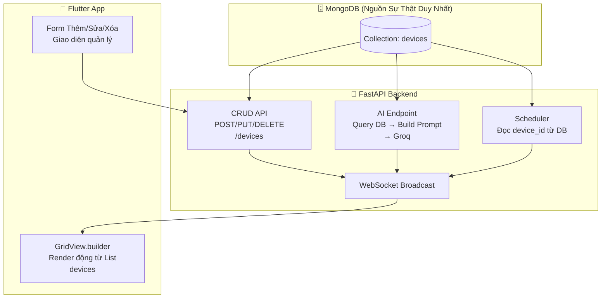

# Kế Hoạch Phát Triển: Hệ Thống Quản Lý Thiết Bị Động (Dynamic Device Registry)

> **Mục tiêu:** Chuyển toàn bộ hệ thống từ "đóng đinh cứng 4 thiết bị trong code" sang mô hình **Device Registry** (Sổ đăng bộ thiết bị động), cho phép thêm/sửa/xóa thiết bị từ giao diện App mà **KHÔNG BAO GIỜ phải sửa code backend hoặc Flutter nữa**.

---

## 1. Phân Tích Hiện Trạng (Cái đang bị "đóng đinh")

### 1.1. Flutter App (`dashboard_screen.dart`)

| Dòng code | Vấn đề | Mô tả |
|-----------|--------|-------|
| Dòng 313-315 | `deviceStates` hardcode | Map cố định 5 key: "Smart AC", "Smart Light", "Smart Fan", "Front Door", "Sensor Hub" |
| Dòng 341-343 | WebSocket listener hardcode | Chỉ xử lý `led_1` → "Smart AC", `led_2` → "Smart Light" |
| Dòng 366-367 | Init snapshot hardcode | Chỉ map `led_1`, `led_2` khi nhận `init` |
| Dòng 382-383 | `_loadDeviceStates` hardcode | Chỉ gọi `getStatus("led_1")`, `getStatus("led_2")` |
| Dòng 399-414 | `_toggleDevice` hardcode | Map thủ công key → deviceId |
| Dòng 479-484 | GridView hardcode | Xây tay 4 card cố định |

### 1.2. Backend (`main.py`)

| Dòng code | Vấn đề | Mô tả |
|-----------|--------|-------|
| Dòng 323-327 | AI Prompt hardcode | Danh sách thiết bị viết tay trong chuỗi prompt |
| Dòng 337 | `device_id` mapping cứng | AI chỉ biết `led_1`, `led_2`, `fan_1` |

### 1.3. Backend - Thiếu API

| API cần có | Hiện trạng |
|------------|-----------|
| `POST /devices` (Tạo thiết bị mới) | ❌ Chưa có |
| `PUT /devices/{id}` (Sửa thông tin) | ❌ Chưa có |
| `DELETE /devices/{id}` (Xóa thiết bị) | ❌ Chưa có |

---

## 2. Kiến Trúc Mới



**Nguyên tắc vàng:** Mọi thành phần (App, AI, Scheduler, Toggle) đều đọc/ghi thông qua MongoDB. Không ai được hardcode bất kỳ device_id nào!

---

## 3. Chi Tiết Thay Đổi Từng File

### PHASE 1: Backend — Thêm CRUD API cho Devices (~15 phút)

#### File: `server_backend/app/main.py`

**Thêm 3 endpoint mới:**

```python
# 1. Tạo thiết bị mới
@app.post("/devices")
async def create_device(data: dict = Body(...)):
    """
    Body ví dụ: {
        "device_id": "ac_1",
        "name": "Điều Hòa Phòng Ngủ",
        "type": "ac",       # light, fan, ac, door, sensor...
        "room": "Phòng Ngủ",
        "icon": "ac_unit"   # Tên Material Icon
    }
    """
    # → Insert vào MongoDB collection "devices"
    # → Broadcast WebSocket {"type": "device_added", ...} cho App biết

# 2. Sửa thông tin thiết bị
@app.put("/devices/{device_id}")
async def update_device(device_id: str, data: dict = Body(...)):
    # → Update name, room, icon, type trong MongoDB
    # → Broadcast WebSocket {"type": "device_updated", ...}

# 3. Xóa thiết bị
@app.delete("/devices/{device_id}")
async def delete_device(device_id: str):
    # → Delete khỏi MongoDB
    # → Xóa luôn schedules liên quan (CASCADE)
    # → Broadcast WebSocket {"type": "device_deleted", device_id: "..."}
```

### PHASE 2: Backend — AI Prompt Động (~5 phút)

#### File: `server_backend/app/main.py` (endpoint `/ai/chat`)

**Thay đổi cốt lõi:**

```python
# TRƯỚC (Hardcode):
prompt = """... DANH SÁCH THIẾT BỊ:
- "led_1": Đèn Phòng Khách
- "led_2": Đèn Phòng Ngủ
- "fan_1": Quạt Máy ..."""

# SAU (Dynamic từ DB):
devices = await db.db["devices"].find({}, {"_id": 0}).to_list(100)
device_list = "\n".join([
    f'- "{d["device_id"]}": {d["name"]} (phòng: {d.get("room", "N/A")}, loại: {d.get("type", "unknown")})'
    for d in devices
])
prompt = f"""...
DANH SÁCH THIẾT BỊ bạn điều khiển được:
{device_list}
...
"""
```

→ Khi thêm "Điều Hòa Phòng Ngủ" vào DB, AI sẽ **TỰ BIẾT** ngay mà không cần sửa code!

### PHASE 3: Flutter App — Render Thiết Bị Động (~30-40 phút)

#### File: `client_app/lib/screens/home/dashboard_screen.dart`

**3.1. Thay `Map<String, bool> deviceStates` bằng `List<Map<String, dynamic>> devices`**

```dart
// TRƯỚC (Hardcode):
Map<String, bool> deviceStates = {
    "Smart AC": false, "Smart Light": false, ...
};

// SAU (Dynamic):
List<Map<String, dynamic>> devices = [];
// Mỗi phần tử: {"device_id": "led_1", "name": "Đèn PK", "room": "PK", "type": "light", "status": false, "icon": "lightbulb"}
```

**3.2. Thay `_loadDeviceStates()` — Gọi 1 API duy nhất**

```dart
// TRƯỚC: Gọi từng thiết bị riêng lẻ
bool acStatus = await ApiService.getStatus("led_1");
bool lightStatus = await ApiService.getStatus("led_2");

// SAU: Gọi 1 phát lấy hết
List<dynamic> allDevices = await ApiService.getAllDevices();
setState(() {
    devices = allDevices.cast<Map<String, dynamic>>();
    isLoading = false;
});
```

**3.3. Thay WebSocket listener — Xử lý theo device_id động**

```dart
// TRƯỚC (Hardcode mapping):
if (deviceId == 'led_1') deviceStates["Smart AC"] = status;
if (deviceId == 'led_2') deviceStates["Smart Light"] = status;

// SAU (Dynamic):
if (type == 'device_update') {
    final idx = devices.indexWhere((d) => d['device_id'] == data['device_id']);
    if (idx != -1) {
        setState(() => devices[idx]['status'] = data['status']);
    }
} else if (type == 'device_added') {
    // Thêm card mới vào danh sách
    setState(() => devices.add(data));
} else if (type == 'device_deleted') {
    // Gỡ card khỏi danh sách
    setState(() => devices.removeWhere((d) => d['device_id'] == data['device_id']));
}
```

**3.4. Thay GridView cố định bằng `GridView.builder` động**

```dart
// TRƯỚC (4 card cố định):
GridView.count(children: [
    _buildDeviceCard("Quạt Máy", ...),
    _buildDeviceCard("Đèn Phòng Khách", ...),
    ...
]);

// SAU (Render từ List):
GridView.builder(
    itemCount: devices.length,
    itemBuilder: (context, index) {
        final d = devices[index];
        return _buildDeviceCard(
            d['name'], d['room'], _getIcon(d['type']),
            d['status'] ?? false, _getColor(d['type']), d['device_id']
        );
    },
);
```

**3.5. Thay `_toggleDevice` — Không cần map key thủ công nữa**

```dart
// TRƯỚC:
if (key == "Smart AC") deviceId = "led_1";
if (key == "Smart Light") deviceId = "led_2";

// SAU: key chính là device_id luôn, truyền thẳng!
void _toggleDevice(String deviceId, bool newState) async {
    final idx = devices.indexWhere((d) => d['device_id'] == deviceId);
    if (idx != -1) setState(() => devices[idx]['status'] = newState);
    bool success = await ApiService.toggleDevice(deviceId, newState);
    if (!success) setState(() => devices[idx]['status'] = !newState); // Rollback
}
```

### PHASE 4: Flutter App — Form Thêm/Sửa/Xóa Thiết Bị (~20 phút)

#### File: `client_app/lib/screens/home/dashboard_screen.dart`

**4.1. Nâng cấp `_showAddDeviceDialog()` hiện có:**

```dart
// Thêm các trường:
// - Tên thiết bị (TextField)
// - Phòng (Dropdown: Phòng Khách, Phòng Ngủ, Nhà bếp, Sân vườn...)
// - Loại thiết bị (Dropdown: light, fan, ac, door, sensor...)
// - Device ID (TextField, ví dụ: "ac_1", "curtain_2"...)
//
// Khi bấm "Thêm ngay":
// → POST /devices lên Backend
// → Backend lưu DB + Broadcast WS
// → GridView tự thêm card mới
```

**4.2. Nâng cấp menu Long-press (Giữ lâu vào card):**

```dart
// Hiện đã có 3 menu:
// - "Chia sẻ thiết bị" → Giữ nguyên
// - "Cài đặt thiết bị" → Sửa thành gọi PUT /devices/{id} (đổi tên, phòng)
// - "Xóa thiết bị"     → Sửa thành gọi DELETE /devices/{id} (xóa thật khỏi DB)
```

### PHASE 5: Thêm API `getAllDevices()` trong ApiService (~5 phút)

#### File: `client_app/lib/services/api_service.dart`

```dart
// Thêm method mới:
static Future<List<dynamic>> getAllDevices() async {
    final response = await http.get(
        Uri.parse('${Constants.baseUrl}/devices'),
        headers: {...}
    );
    if (response.statusCode == 200) return jsonDecode(response.body);
    return [];
}

// Thêm method tạo thiết bị:
static Future<bool> createDevice(Map<String, dynamic> data) async { ... }

// Thêm method xóa thiết bị:
static Future<bool> deleteDevice(String deviceId) async { ... }
```

---

## 4. Bảng Icon Tự Động Theo Loại Thiết Bị

Thêm hàm helper trong Flutter để map `type` → `IconData` + `Color`:

```dart
IconData _getIcon(String type) {
    switch (type) {
        case 'light': return Icons.lightbulb;
        case 'fan':   return Icons.mode_fan_off;
        case 'ac':    return Icons.ac_unit;
        case 'door':  return Icons.lock;
        case 'curtain': return Icons.curtains;
        case 'sensor':  return Icons.sensors;
        default: return Icons.devices;
    }
}

Color _getColor(String type) {
    switch (type) {
        case 'light': return Colors.orange;
        case 'fan':   return Colors.lightGreen;
        case 'ac':    return Colors.blue;
        case 'door':  return Colors.cyan;
        default: return Colors.grey;
    }
}
```

---

## 5. Ví Dụ Thực Tế: Kịch Bản Từ Đầu Đến Cuối

### Kịch bản: Thêm "Điều Hòa Phòng Ngủ"

1. **Người dùng** mở App → Bấm nút **[+]** trên Dashboard
2. **App** hiển thị Form → Nhập:
   - Tên: `Điều Hòa Phòng Ngủ`
   - Phòng: `Phòng Ngủ`
   - Loại: `ac`
   - Device ID: `ac_1`
3. **App** gọi `POST /devices` → Backend lưu MongoDB → Broadcast WS
4. **Dashboard** tự động xuất hiện thêm 1 card mới "Điều Hòa Phòng Ngủ" 🧊
5. **Nói giọng**: *"Nhà ơi bật điều hòa phòng ngủ"* → AI query DB, thấy `ac_1` → Bật!
6. **Hẹn giờ**: Vào tab Lịch trình → Chọn `ac_1` → Hẹn tắt lúc 6h sáng → Hoạt động!
7. **Xóa**: Giữ lâu card → Bấm "Xóa thiết bị" → Card biến mất + DB dọn sạch

**Tổng kết: Toàn bộ ý trên KHÔNG SỬA 1 DÒNG CODE NÀO sau khi deploy!**

---

## 6. Danh Sách File Cần Sửa

| File | Hành động | Mức độ |
|------|-----------|--------|
| `server_backend/app/main.py` | Thêm CRUD API + Sửa AI prompt động | ⭐⭐ |
| `client_app/lib/services/api_service.dart` | Thêm 3 method mới | ⭐ |
| `client_app/lib/screens/home/dashboard_screen.dart` | Refactor lớn: render động + form thêm/xóa | ⭐⭐⭐ |

> **Lưu ý quan trọng:** File `firmware_esp32/src/main.cpp` KHÔNG SỬA trong phase này. Phần cứng vẫn giữ nguyên, chỉ cần đảm bảo các device_id trên App khớp với topic MQTT mà ESP32 đang subscribe.

---

## 7. Thời Gian Ước Tính

| Phase | Nội dung | Thời gian |
|-------|----------|-----------|
| 1 | Backend CRUD API | ~15 phút |
| 2 | AI Prompt Động | ~5 phút |
| 3 | Flutter render động | ~30-40 phút |
| 4 | Form Thêm/Sửa/Xóa | ~20 phút |
| 5 | ApiService methods | ~5 phút |
| | **Tổng cộng** | **~1 giờ 15 phút** |
